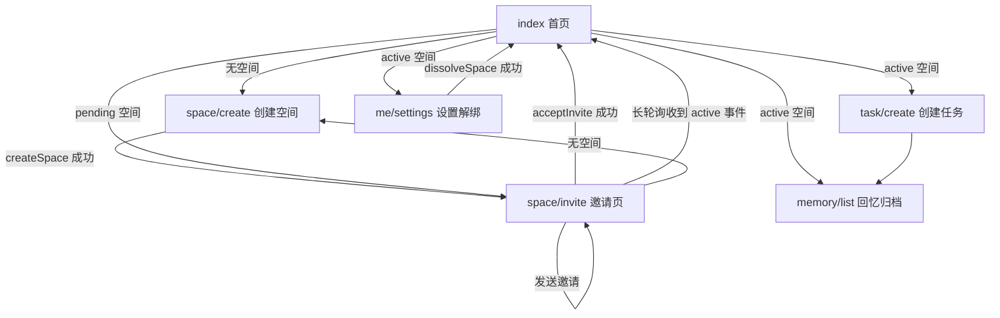

# Mystwood 小程序项目参考

> 更新日期：2026-06-03
> 用途：作为产品目标、工程实现、数据模型、接口和后续规划的唯一项目文档。
> 当前口径：原生微信小程序 + 微信云函数；没有独立 HTTP 后端，业务调用统一走 `wx.cloud.callFunction`。

## 1. 产品边界

Mystwood 是一个双人亲密度小程序。聚焦“创建空间 -> 邀请对方加入空间 -> 创建任务邀请对方一起完成 -> 双方执行任务 -> 结算积分 -> 任务沉淀回忆”的闭环。

已确认规则：

1. 一个用户只能拥有或加入 1 个空间。
2. 空间创建后为 `pending`，对方接受邀请后变为 `active`。
3. 解绑后历史数据不保留。
4. 任务单方创建后可分享邀请对方一起完成，对方如果不接受，也可单方完成。
5. 亲密度是隐藏分，通过空间主题和页面 UI 元素表现，不直接展示数值。
6. 当前同步提醒聚焦在线状态；离线微信通知暂不实现。


## 2. 当前状态

已实现：

1. 空间创建。
2. 邀请码和微信分享邀请。
3. 接收方按 `inviteToken` 接受邀请。
4. 发送方邀请页通过伪 socket 长轮询接收 `INVITE_CONFIRMED` 事件，空间变为 `active` 后自动跳转首页。
5. 任务创建和完成。
6. 回忆归档，由 `completed` / `overdue` 任务派生。
7. 解绑空间。
8. 主题逻辑收敛在 `space-service`，首页直接使用 `state.space.theme`。
9. `acceptInvite`、`createTask`、`completeTask`、`dissolveSpace` 会更新 `spaces.sync.changes`，供长轮询同步和问题追溯。
10. 首页通过 `waitSyncEvents` 长轮询接收邀请确认、任务创建、任务完成或解绑事件，收到后刷新 `getState()` 并提示。
11. 在线协同同步只走伪 socket 长轮询云函数；不使用 `wx.connectSocket` 或外部 `wss://` 服务。

## 3. 目录

```text
miniprogram/
  app.js                         # 初始化 wx.cloud
  config.js                      # 云环境 ID
  utils/api.js                   # 小程序端云函数调用封装
  pages/index/index              # 首页/空间主页
  pages/space/create             # 创建空间
  pages/space/invite             # 邀请、分享、接受邀请
  pages/task/create              # 创建任务
  pages/memory/list              # 回忆归档
  pages/me/settings              # 设置/解绑
cloudfunctions/
  space-service                  # 空间、邀请、状态聚合、主题
  task-service                   # 任务创建、完成
AGENTS.md                        # Codex/AI 协作提示文件
```

`miniprogram/app.json` 当前注册页面：

```json
[
  "pages/index/index",
  "pages/space/create",
  "pages/space/invite",
  "pages/task/create",
  "pages/memory/list",
  "pages/me/settings"
]
```

## 4. 运行部署

1. 微信开发者工具导入仓库根目录 `/Users/yuicer/code/Mystwood`。
2. 确认云开发环境为 `cloud1-d1gawczd613a07bab`。
3. 上传并部署 `cloudfunctions`。
4. 确认云数据库有创建好的 db collection 集合：`spaces`。
5. 在线同步由 `space-service/waitSyncEvents` 长轮询模拟 socket；可在 `miniprogram/config.js` 调整 `syncLongPoll.timeoutMs` 和 `syncLongPoll.intervalMs`。

## 5. 用户流程



| 页面 | 数据来源 | 主要动作 | 路由/API |
| --- | --- | --- | --- |
| `pages/index/index` | `api.getState()`、`api.waitSyncEvents()` | 展示空间、任务、完成任务、前台同步事件 | `wx.navigateTo`、`wx.showToast` |
| `pages/space/create` | 表单 | 创建空间 | `wx.redirectTo` |
| `pages/space/invite` | `api.getState()`、`api.getInvite(inviteToken)`、`api.waitSyncEvents()` | 复制邀请码、微信分享邀请、接受邀请、接收发送方同步状态 | `wx.setClipboardData`、`wx.showShareMenu`、`open-type="share"`、`wx.redirectTo` |
| `pages/task/create` | 表单 | 创建任务 | `wx.navigateTo`、`wx.showToast` |
| `pages/memory/list` | `api.getState()` | 展示 completed/overdue 任务 | `wx.showToast` |
| `pages/me/settings` | 无持久设置 | 解绑空间 | `wx.showModal`、`wx.reLaunch` |

## 6. 业务 API

页面通过 `miniprogram/utils/api.js` 调云函数，不直接散落调用 `wx.cloud.callFunction`。

| 方法 | 云函数/action | 入参 | 返回 |
| --- | --- | --- | --- |
| `getState()` | `space-service/getState` | 无 | `{ space, tasks, memories, syncCursor }` |
| `createSpace(name)` | `space-service/createSpace` | `name` | 新建空间 |
| `getInvite(inviteToken)` | `space-service/getInvite` | `inviteToken` | 邀请空间公开信息 |
| `acceptInvite(inviteToken)` | `space-service/acceptInvite` | `inviteToken` | `true` |
| `dissolveSpace()` | `space-service/dissolveSpace` | 无 | `true` |
| `waitSyncEvents(options)` | `space-service/waitSyncEvents` | `{ cursor, timeoutMs, intervalMs, limit }` | `{ events, cursor, serverTime }` |
| `createTask(payload)` | `task-service/createTask` | 任务表单 | 新建任务 |
| `completeTask(id)` | `task-service/completeTask` | 任务 ID | `true` |

云函数统一成功返回：

```js
{ code: 0, data: {} }
```

错误返回：

```js
{ code: 400, message: "错误信息" }
```

## 7. 云函数

### `space-service`

| action | 当前逻辑 | 主要风险 |
| --- | --- | --- |
| `getState` | 按 `members` 查询当前空间，从 `space.tasks` 派生任务和回忆，返回 `syncCursor` | 单文档任务数量需要控制 |
| `createSpace` | 创建 `pending` 空间、邀请码、默认分数、主题、空任务数组和 `sync` 初始状态 | 已限制用户只能有一个未解绑空间 |
| `getInvite` | 按 `inviteToken` 查询 `pending` 空间，返回公开邀请信息 | 不暴露成员列表 |
| `acceptInvite` | 按 `inviteToken` 查询 `pending` 空间，加入当前用户并把空间置为 `active`，追加 `INVITE_CONFIRMED` change | 当前限制用户已有空间时不能再接受 |
| `dissolveSpace` | 追加 `SPACE_DISSOLVED` change，清空成员、邀请码和任务，并把空间标记为 `dissolved` | 仅保留最小同步痕迹 |
| `waitSyncEvents` | 校验当前用户空间后长轮询 `space.sync.changes`，返回 `v > cursor` 的目标 change | 云函数超时时间需高于 `timeoutMs` |

主题阈值：

| 分数 | 主题 |
| --- | --- |
| `< 40` | `静谧浅滩` |
| `< 80` | `日光暖湾` |
| `>= 80` | `晴空海岸` |

### `task-service`

| action | 当前逻辑 | 主要风险 |
| --- | --- | --- |
| `createTask` | 校验标题、当前空间且空间必须 `active`，追加到 `space.tasks` 并写入 `TASK_CREATED` change | 单文档任务数量需要控制 |
| `completeTask` | 校验任务属于当前用户空间后更新 `space.tasks` 中的任务状态，并写入 `TASK_COMPLETED` change | 未更新分数 |

## 8. 数据模型

### `spaces`

| 字段 | 说明 |
| --- | --- |
| `_id` | 云数据库文档 ID |
| `name` | 空间名称 |
| `status` | `pending` / `active` / `dissolved` |
| `members` | 成员 OPENID 数组，当前产品限定 2 人 |
| `inviteToken` | 邀请码 |
| `score` | 隐藏亲密分 |
| `theme` | 当前主题对象 |
| `tasks` | 当前空间下的任务数组 |
| `sync` | 同步游标和 change 队列 |
| `createdAt` | 创建时间戳 |
| `dissolvedAt` | 解绑时间戳，可为空 |

### `spaces.tasks[]`

| 字段 | 说明 |
| --- | --- |
| `_id` | 任务 ID，云函数生成 |
| `creator` | 创建人 OPENID |
| `title` | 标题 |
| `locationName` | 地点文本 |
| `imageUrl` | 图片地址，当前手填 |
| `deadline` | 截止时间戳或 `null` |
| `status` | `todo` / `completed` / `overdue` |
| `createdAt` | 创建时间戳 |
| `completedAt` | 完成时间戳 |

### `spaces.sync`

| 字段 | 说明 |
| --- | --- |
| `version` | 当前同步版本号，每次写入 change 递增 |
| `updatedAt` | 最近同步更新时间戳 |
| `changes` | 最近 change 队列，当前保留最近 50 条 |

## 9. 微信 API 清单

| API | 用途 | 注意 |
| --- | --- | --- |
| `wx.cloud.init` | 初始化云开发 | `env` 已配置为当前云环境 ID |
| `wx.cloud.callFunction` | 调用云函数 | 业务结果读取 `res.result` |
| `wx.showShareMenu` | 开启页面右上角分享入口 | 分享内容由页面 `onShareAppMessage` 返回 |
| `button open-type="share"` | 调起微信原生分享 | 小程序不能用普通 JS 任意时机强制弹出分享面板 |
| `wx.showToast` | 轻提示 | 错误文案用 `icon: "none"` |
| `wx.navigateTo` | 跳非 tabBar 页面 | 当前项目无 tabBar |
| `wx.redirectTo` | 替换当前页跳转 | 创建/邀请流程使用 |
| `wx.reLaunch` | 重置页面栈 | 解绑后回首页 |
| `wx.showModal` | 危险操作确认 | 解绑确认 |
| `wx.setClipboardData` | 复制邀请码 | 需要确保 token 存在 |
后续建议接入：`wx.chooseMedia` + `wx.cloud.uploadFile` 做图片凭证，`wx.getLocation` / `wx.chooseLocation` 做地点。

## 10. 双方数据协同策略

协同目标：任何涉及双方关系、任务和亲密度表现的状态，都以云函数写入后的云数据库为真相源；小程序端只做乐观展示和刷新触发，不在本地制造安全字段或最终状态。

### 当前已落地的最小闭环

1. 服务端以 `spaces.status` 作为邀请是否完成的真相源。
2. `createSpace` 创建 `pending` 空间。
3. `acceptInvite` 成功后把空间状态更新为 `active`。
4. 页面进入后启动伪 socket 客户端，持续调用 `waitSyncEvents()` 长轮询云函数。
5. 接收方接受邀请后写入 `INVITE_CONFIRMED` 事件；发送方如果停留在首页或邀请页，长轮询返回该事件，客户端刷新并提示。
6. 发送方如果点开自己分享出去的邀请链接，邀请页会先判断当前用户是否属于该 `inviteToken` 对应空间；如果空间已激活则提示并跳转首页。
7. 双方进入 `active` 空间后，创建任务会写入 `TASK_CREATED` 事件；对方首页通过长轮询收到后刷新待办列表。
8. 页面隐藏或卸载时停止长轮询客户端。

### 后续原则

1. 服务端优先：空间归属、任务归属、完成状态、亲密分和主题都由云函数决定。
2. 状态机优先：邀请、任务协作、解绑都先定义清晰状态，再实现页面交互。
3. 事件可追溯：关键写操作沉淀为 `space.sync.changes`，便于按版本去重、补偿、消息推送和问题排查。
4. 在线刷新：在线时只用伪 socket 长轮询接收协同事件；离线微信通知暂不实现。
5. 双方视角一致：列表、回忆、主题由 `getState()` 聚合返回，避免每个页面各自拼接状态。
6. 微信当前云函数架构不承接 WebSocket 常驻服务；项目内用长轮询云函数模拟 socket 接收通道。

### 建议状态机

| 场景 | 状态 | 说明 |
| --- | --- | --- |
| 空间 | `pending` / `active` | 邀请未接受 / 双方已绑定 |
| 任务 | `todo` / `completed` / `overdue` | 当前最小任务状态 |
| 任务协作邀请 | `none` / `invited` / `accepted` / `declined` | 后续新增，允许对方明确参与或拒绝 |
| 解绑 | `dissolved` 或直接删除 | 当前直接删除；如果要保留审计，可改为软删除 |
| 同步 | `version` 递增 | 用 `space.sync.version` 做游标和去重依据 |

### 当前同步数据

#### `spaces.sync.changes[]`

| 字段 | 说明 |
| --- | --- |
| `v` | change 版本号，用作同步游标 |
| `type` | `INVITE_CONFIRMED` / `TASK_CREATED` / `TASK_COMPLETED` / `SPACE_DISSOLVED` |
| `targets` | 需要感知该 change 的 OPENID，服务端过滤用，不返回客户端 |
| `entity` | `space` / `task` |
| `entityId` | 关联实体 ID |
| `payload` | 页面展示所需的最小冗余信息 |
| `at` | 创建时间戳 |

### 建议新增数据

#### `task_receipts`

| 字段 | 说明 |
| --- | --- |
| `_id` | 回执 ID |
| `taskId` | 所属任务 |
| `spaceId` | 所属空间 |
| `openid` | 成员 OPENID |
| `role` | `creator` / `partner` |
| `inviteStatus` | `none` / `invited` / `accepted` / `declined` |
| `readAt` | 用户最后查看时间 |
| `updatedAt` | 更新时间 |

### 演进路线

| 阶段 | 目标 | 任务 |
| --- | --- | --- |
| P0 安全补强 | 先把数据写正确 | 限制一个用户只能有一个空间；解绑时级联删除任务；完成任务后更新隐藏分和主题 |
| P1 双方任务协作 | 让“邀请一起做”成为明确状态 | 任务增加协作邀请状态；对方可接受/拒绝；首页区分“我创建的”“等我确认的”“一起完成的”；`getState()` 返回双方视角所需字段 |
| P2 消息与同步 | 让变化能被对方及时感知 | 完善长轮询参数和 `spaces.sync.changes` 清理 |
| P3 体验增强 | 让任务和回忆更像真实记录 | 接入 `wx.chooseMedia` + 云存储；接入位置选择；回忆页展示双方参与状态、完成时间和凭证图片 |
| P4 可靠性 | 降低边界场景问题 | 给 `spaces.members`、`spaces.inviteToken` 建索引；关键写操作考虑事务；增加云函数输入校验和幂等键 |

### 同步实现建议

同步按“云函数写入 + 伪 socket 长轮询接收”演进：

1. 实时事件：客户端长轮询 `waitSyncEvents()`，云函数查询 `space.sync.changes` 并返回目标用户 change。
2. 事件类型：`INVITE_CONFIRMED`、`TASK_CREATED`、`TASK_COMPLETED`、`SPACE_DISSOLVED`。
3. 可靠性：落库先于返回，客户端按 `v` / `syncCursor` 去重。
4. 验收指标：发送方在接收方确认后 P95 感知时延小于 5 秒。

## 11. 近期任务清单

优先级按“先保证数据不会错，再增强协同体验”排序。

| 优先级 | 任务 | 验收标准 |
| --- | --- | --- |
| P0 | `createSpace` 前检查当前用户是否已有空间 | 重复创建会返回明确错误，不会产生第二个空间 |
| P0 | 解绑时删除或标记当前空间下所有任务 | 解绑后 `getState()` 不再返回旧任务和旧回忆 |
| P0 | 完成任务后更新 `spaces.score` 和 `theme` | 首页主题跟随隐藏分变化，客户端不直接计算分数 |
| P1 | 设计任务协作邀请字段和页面入口 | 对方能看到“待确认一起完成”的任务 |
| P1 | 增加任务接受/拒绝云函数 action | 接受/拒绝后双方首页刷新结果一致 |
| P2 | 完善长轮询同步和 `spaces.sync.changes` 清理策略 | 在线用户只通过长轮询收到协同 change，旧 change 不会无限增长 |

## 12. 开发约定

1. 新业务方法先加 `miniprogram/utils/api.js`。
2. 云函数写操作必须用 `cloud.getWXContext().OPENID` 做权限校验。
3. 小程序端不信任 `spaceId`、`creator` 等安全字段，由云函数生成。
4. 大文件走云存储，不通过 `callFunction` 传输。
5. 除非新增独立 HTTP 后端或云托管，不再写 `POST /xxx` 风格接口。
6. 新增双方协同能力时，先更新本 README 的状态机、数据模型和任务清单，再改代码。
7. AI/Codex 协作习惯写在根目录 `AGENTS.md`；README 写“项目事实”，AGENTS 写“协作方式和工程偏好”。
