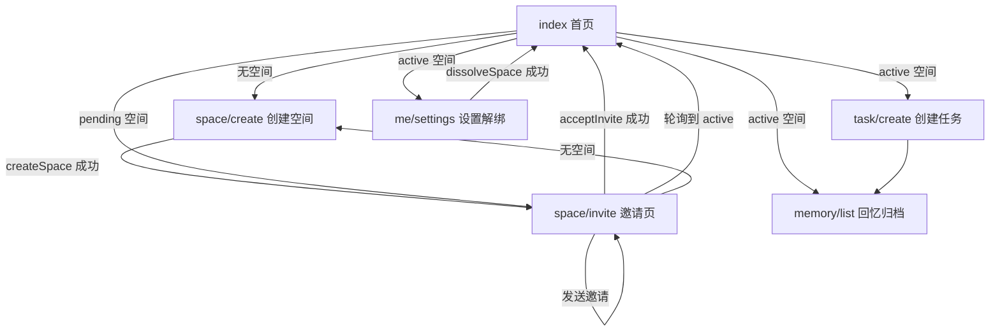

# Mystwood 小程序项目参考

> 更新日期：2026-05-26  
> 用途：作为产品目标、工程实现、数据模型、接口和后续规划的唯一项目文档。  
> 当前口径：原生微信小程序 + 微信云函数；没有独立 HTTP 后端，业务调用统一走 `wx.cloud.callFunction`。

## 1. 产品边界

Mystwood 是一个双人亲密空间小程序。MVP 聚焦“创建空间 -> 邀请对方 -> 双方执行任务 -> 沉淀回忆 -> 可解绑”的闭环。

已确认规则：

1. 一个用户只能拥有或加入 1 个空间。
2. 空间创建后为 `pending`，对方接受邀请后变为 `active`。
3. 解绑后历史数据不保留。
4. 图片凭证可选，当前仍是图片地址。
5. 定位默认尝试获取，也可不填。
6. 任务完成不需要另一方确认，但另一方可查看。
7. 亲密度是隐藏分，通过空间主题表现，不直接展示数值。
8. 后续需要订阅消息提醒能力。

当前已删除/暂缓：

1. 类/Category 页面与规则系统。
2. 独立 `category-service`。
3. 独立 `theme-service`。
4. `utils/theme.js`。

## 2. 当前状态

已实现：

1. 空间创建。
2. 邀请码和微信分享邀请。
3. 接收方按 `inviteToken` 接受邀请。
4. 发送方邀请页通过 `getInviteState` 轮询状态，空间变为 `active` 后自动跳转首页。
5. 任务创建和完成。
6. 回忆归档，由 `completed` / `overdue` 任务派生。
7. 解绑空间。
8. 主题逻辑收敛在 `space-service`，首页直接使用 `state.space.theme`。

当前云环境 ID：`cloud1-d1gawczd613a07bab`，配置在 `miniprogram/config.js`。

## 3. 目录

```text
miniprogram/
  app.js                         # 初始化 wx.cloud
  config.js                      # 云环境 ID
  utils/api.js                   # 小程序端云函数调用封装
  pages/index/index              # 首页/空间主页
  pages/space/create             # 创建空间
  pages/space/invite             # 邀请、分享、接受邀请
  pages/task/create              # 创建任务
  pages/memory/list              # 回忆归档
  pages/me/settings              # 设置/解绑
cloudfunctions/
  space-service                  # 空间、邀请、状态聚合、主题
  task-service                   # 任务创建、完成
docs/
  project-reference.md           # 唯一项目文档
```

`miniprogram/app.json` 当前注册页面：

```json
[
  "pages/index/index",
  "pages/space/create",
  "pages/space/invite",
  "pages/task/create",
  "pages/memory/list",
  "pages/me/settings"
]
```

## 4. 运行部署

1. 微信开发者工具导入仓库根目录 `/Users/yuicer/code/Mystwood`。
2. 确认云开发环境为 `cloud1-d1gawczd613a07bab`。
3. 上传并部署 `cloudfunctions/space-service` 和 `cloudfunctions/task-service`。
4. 确认云数据库有 `spaces`、`tasks` 集合。

## 5. 用户流程


```mermaid
flowchart TD
  Index["index 首页"]
  CreateSpace["space/create 创建空间"]
  Invite["space/invite 邀请页"]
  CreateTask["task/create 创建任务"]
  Memory["memory/list 回忆归档"]
  Settings["me/settings 设置解绑"]

  Index -->|无空间| CreateSpace
  CreateSpace -->|createSpace 成功| Invite
  Index -->|pending 空间| Invite
  Invite -->|发送邀请| Invite
  Invite -->|acceptInvite 成功| Index
  Invite -->|轮询到 active| Index
  Invite -->|无空间| CreateSpace
  Index -->|active 空间| CreateTask
  Index -->|active 空间| Memory
  Index -->|active 空间| Settings
  CreateTask --> Memory
  Settings -->|dissolveSpace 成功| Index
```

| 页面 | 数据来源 | 主要动作 | 路由/API |
| --- | --- | --- | --- |
| `pages/index/index` | `api.getState()` | 展示空间、任务、完成任务 | `wx.navigateTo`、`wx.showToast` |
| `pages/space/create` | 表单 | 创建空间 | `wx.redirectTo` |
| `pages/space/invite` | `api.getState()`、`api.getInvite(inviteToken)`、`api.getInviteState(inviteToken)` | 复制邀请码、微信分享邀请、接受邀请、轮询发送方状态 | `wx.setClipboardData`、`wx.showShareMenu`、`open-type="share"`、`wx.redirectTo` |
| `pages/task/create` | 表单 | 创建任务 | `wx.navigateTo`、`wx.showToast` |
| `pages/memory/list` | `api.getState()` | 展示 completed/overdue 任务 | `wx.showToast` |
| `pages/me/settings` | 无持久设置 | 解绑空间 | `wx.showModal`、`wx.reLaunch` |

## 6. 业务 API

页面通过 `miniprogram/utils/api.js` 调云函数，不直接散落调用 `wx.cloud.callFunction`。

| 方法 | 云函数/action | 入参 | 返回 |
| --- | --- | --- | --- |
| `getState()` | `space-service/getState` | 无 | `{ space, tasks, memories }` |
| `createSpace(name)` | `space-service/createSpace` | `name` | 新建空间 |
| `getInvite(inviteToken)` | `space-service/getInvite` | `inviteToken` | 邀请空间公开信息 |
| `getInviteState(inviteToken)` | `space-service/getInviteState` | `inviteToken` | `{ spaceId, name, inviteToken, status }` |
| `acceptInvite(inviteToken)` | `space-service/acceptInvite` | `inviteToken` | `true` |
| `dissolveSpace()` | `space-service/dissolveSpace` | 无 | `true` |
| `createTask(payload)` | `task-service/createTask` | 任务表单 | 新建任务 |
| `completeTask(id)` | `task-service/completeTask` | 任务 ID | `true` |

云函数统一成功返回：

```js
{ code: 0, data: {} }
```

错误返回：

```js
{ code: 400, message: "错误信息" }
```

## 7. 云函数

### `space-service`

| action | 当前逻辑 | 主要风险 |
| --- | --- | --- |
| `getState` | 按 `members` 查询当前空间，查空间任务，派生回忆 | 查询未分页 |
| `createSpace` | 创建 `pending` 空间、邀请码、默认分数和主题 | 未限制一个用户只能有一个空间 |
| `getInvite` | 按 `inviteToken` 查询 `pending` 空间，返回公开邀请信息 | 不暴露成员列表 |
| `getInviteState` | 按 `inviteToken` 查询空间，返回邀请状态 | 当前仅供发送方轮询 |
| `acceptInvite` | 按 `inviteToken` 查询 `pending` 空间，加入当前用户并把空间置为 `active` | 当前限制用户已有空间时不能再接受 |
| `dissolveSpace` | 删除当前空间 | 未级联删除任务 |

主题阈值：

| 分数 | 主题 |
| --- | --- |
| `< 40` | `静谧浅滩` |
| `< 80` | `日光暖湾` |
| `>= 80` | `晴空海岸` |

### `task-service`

| action | 当前逻辑 | 主要风险 |
| --- | --- | --- |
| `createTask` | 校验标题和空间后写入 `todo` 任务 | 未校验空间必须 `active` |
| `completeTask` | 按任务 ID 更新为 `completed` | 未校验任务归属，未更新分数 |

## 8. 数据模型

### `spaces`

| 字段 | 说明 |
| --- | --- |
| `_id` | 云数据库文档 ID |
| `name` | 空间名称 |
| `status` | `pending` / `active` |
| `members` | 成员 OPENID 数组，当前产品限定 2 人 |
| `inviteToken` | 邀请码 |
| `score` | 隐藏亲密分 |
| `theme` | 当前主题对象 |
| `createdAt` | 创建时间戳 |

### `tasks`

| 字段 | 说明 |
| --- | --- |
| `_id` | 云数据库文档 ID |
| `spaceId` | 所属空间 |
| `creator` | 创建人 OPENID |
| `title` | 标题 |
| `locationName` | 地点文本 |
| `imageUrl` | 图片地址，当前手填 |
| `deadline` | 截止时间戳或 `null` |
| `status` | `todo` / `completed` / `overdue` |
| `createdAt` | 创建时间戳 |
| `completedAt` | 完成时间戳 |

## 9. 微信 API 清单

| API | 用途 | 注意 |
| --- | --- | --- |
| `wx.cloud.init` | 初始化云开发 | `env` 已配置为当前云环境 ID |
| `wx.cloud.callFunction` | 调用云函数 | 业务结果读取 `res.result` |
| `wx.showShareMenu` | 开启页面右上角分享入口 | 分享内容由页面 `onShareAppMessage` 返回 |
| `button open-type="share"` | 调起微信原生分享 | 小程序不能用普通 JS 任意时机强制弹出分享面板 |
| `wx.showToast` | 轻提示 | 错误文案用 `icon: "none"` |
| `wx.navigateTo` | 跳非 tabBar 页面 | 当前项目无 tabBar |
| `wx.redirectTo` | 替换当前页跳转 | 创建/邀请流程使用 |
| `wx.reLaunch` | 重置页面栈 | 解绑后回首页 |
| `wx.showModal` | 危险操作确认 | 解绑确认 |
| `wx.setClipboardData` | 复制邀请码 | 需要确保 token 存在 |

后续建议接入：`wx.chooseMedia` + `wx.cloud.uploadFile` 做图片凭证，`wx.getLocation` / `wx.chooseLocation` 做地点，`wx.requestSubscribeMessage` 做提醒。

## 10. 实时同步策略

当前已落地的最小方案：

1. 服务端以 `spaces.status` 作为邀请是否完成的真相源。
2. `createSpace` 创建 `pending` 空间。
3. `acceptInvite` 成功后把空间状态更新为 `active`。
4. 发送方邀请页调用 `getInviteState(inviteToken)`，按 2s、3s、5s、8s 退避轮询。
5. 轮询到 `status === "active"` 后提示“对方已确认加入”，并自动跳转首页。
6. 页面隐藏或卸载时停止轮询。

后续如果需要更实时的体验，可按“状态机 + 实时事件 + 轮询兜底 + 离线订阅消息”演进：

1. 实时事件：优先考虑云数据库实时监听或云托管 WebSocket。
2. 事件类型：`INVITE_CONFIRMED`、`TASK_CREATED`、`TASK_COMPLETED`、`SPACE_DISSOLVED`。
3. 可靠性：落库先于广播，客户端按 `eventId` 去重。
4. 离线补偿：使用订阅消息提醒发送方或对方查看变化。
5. 验收指标：发送方在接收方确认后 P95 感知时延小于 3 秒。

## 11. 优先级

P0：

1. 部署 `space-service`、`task-service` 到 `cloud1-d1gawczd613a07bab`。
2. 创建并配置 `spaces`、`tasks` 集合权限。

P1：

1. `createSpace`：限制一个用户只能有一个空间。
2. `completeTask`：校验任务属于当前用户空间。
3. `dissolveSpace`：级联删除当前空间下任务。
4. `createTask`：校验空间必须 `active`。
5. `acceptInvite`：考虑幂等处理重复点击和弱网重试。

P2：

1. 图片从手填 URL 改为云存储。
2. 地点从手填文本改为定位/地图选择。
3. 接入订阅消息。
4. 任务创建、完成和解绑接入实时通知。
5. 如产品仍需要，再恢复/重设类与规则系统。

## 12. 开发约定

1. 新业务方法先加 `miniprogram/utils/api.js`。
2. 云函数写操作必须用 `cloud.getWXContext().OPENID` 做权限校验。
3. 小程序端不信任 `spaceId`、`creator` 等安全字段，由云函数生成。
4. 大文件走云存储，不通过 `callFunction` 传输。
5. 除非新增独立 HTTP 后端或云托管，不再写 `POST /xxx` 风格接口。
